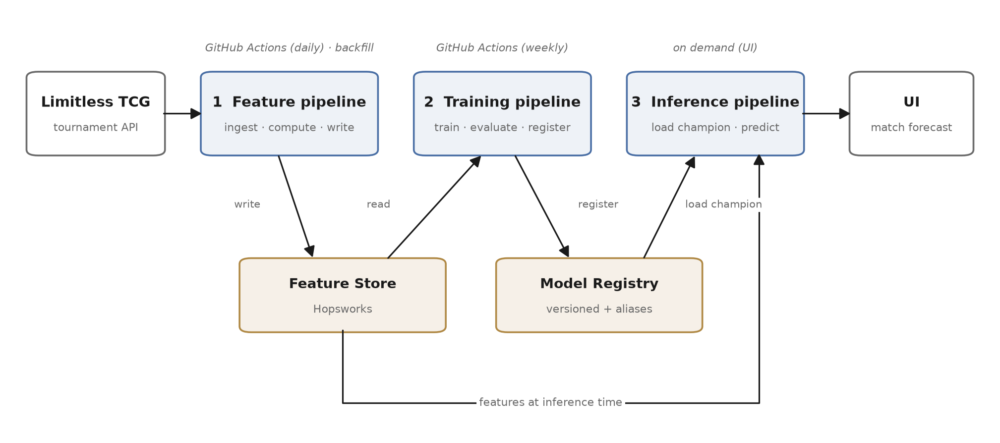

# optcg-swiss-forecast

Predicting who wins a match in a One Piece Card Game tournament.

Semester project for **I.BA_MLOPS** (MLOps), BSc Artificial Intelligence & Machine Learning,
Hochschule Luzern — HS26.

---

## What this is

One Piece Card Game tournaments are played in swiss rounds: every round pairs players against
each other, and every pairing has a winner. Given the two decks and, if I know them, the two
players, I want to predict the probability that the first player wins.

The reason this is interesting is that the usual statistic lies a little. "This deck wins 60% of
its games" is partly measuring *who chose to play it*, because good players pick good decks. I
want to separate the deck from the player.

## Status

Week 3 of the semester. The proposal is written; the pipelines are not built yet.

| Milestone | Due | Status |
|---|---|---|
| MS1 — Proposal | 2026-10-01 | see [`docs/proposal.pdf`](docs/proposal.pdf) |
| MS2 — Feature pipeline | 2026-11-05 | not started |
| MS3 — Training pipeline | 2026-12-03 | not started |
| MS4 — Live system | 2027-01-10 | not started |

## Data

Tournament results come from [Limitless TCG](https://play.limitlesstcg.com) through its public
JSON API. No login, no scraping. New tournaments appear there as they finish, so the data keeps
arriving rather than sitting in a file.

## Planned tools

Everything here is either named in the module or the obvious default, on purpose — the point of
the course is the pipeline, not collecting unusual tools.

| | |
|---|---|
| Feature store | Hopsworks (free tier) |
| Experiment tracking | Weights & Biases |
| Orchestration | GitHub Actions, on a schedule |
| Model | scikit-learn gradient boosting |
| Serving | FastAPI in Docker, on Google Cloud Run |
| Tests / CI | pytest and ruff, on every push |

## Planned structure

The course calls this the FTI architecture: three pipelines that do not call each other.

- **Feature pipeline** — fetch new tournaments daily, turn them into rows, save them.
- **Training pipeline** — read those rows weekly, train a model, keep it if it is good enough.
- **Inference pipeline** — load the saved model and answer questions.

